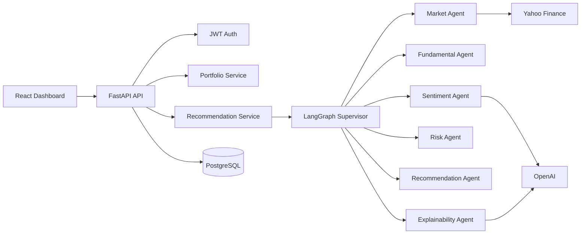

# Architecture

## Principles

- API routes coordinate only; business logic lives in services and agents.
- Recommendations are deterministic and auditable.
- LLMs explain recommendations; they do not choose actions.
- Market and sentiment failures degrade gracefully where possible.

## Data Model

Core tables:

- `users`
- `portfolios`
- `holdings`
- `recommendation_runs`
- `recommendations`
- `market_cache`
- `sentiment_cache`
- `portfolio_analysis_runs`
- `portfolio_analysis_results`
- `audit_logs`
